# Zoho Contact Editor Widget

A Zoho CRM widget (Related List type) embedded on the Contact record detail page. It displays and
lets you edit a Contact's core fields, plus a postal-code-driven address lookup — all persisted
back to the real CRM record, not local state.

Plain HTML/CSS/JS, no framework, no build step,
using the [Zoho Extension Toolkit](https://www.npmjs.com/package/zoho-extension-toolkit) (`zet`).

## Demo

📹 [Screen recording (≤3 min)](https://youtu.be/nQIrGM4RlUE) — walkthrough of display, edit, and address lookup, including the auto-fill and manual-fallback paths.

## What it does

- **Display** — First Name, Last Name, Phone, and Email are read live from the Contact record via
  `ZOHO.CRM.API.getRecord` on `PageLoad` (never hardcoded).
- **Edit** — those four fields are editable in place and saved back with `ZOHO.CRM.API.updateRecord`.
  Reloading the widget or the record page shows the updated values, confirming the write actually
  landed in CRM.
- **Address lookup** — a Postal Code field triggers a lookup against a public geocoding API and
  auto-fills City, State/Province, and (when unambiguous) Country. Street Address, and an extra
  Flat/House No./Building/Apartment Name field, stay manual. Everything in this section — including
  the latitude/longitude the lookup APIs return for free — is saved to the Contact's native
  `Mailing_*` fields.
- **Interface polish** — a save-state pill (*Saving… / Saved ✓ / Error*), `auto`/`manual` badges
  with tooltips on the address fields, and a brief highlight flash when a field gets auto-filled, so
  it's always clear what came from the API and what the user typed.

## Install and run in a fresh Zoho org

The widget ships as a `.zip` hosted by Zoho itself — no server of yours needs to stay online for it
to work. This is the delivery path; see [Local development](#local-development-alternative) below
for the workflow used while building it.

### 1. Prerequisites

**Required no matter what:**

- A free Zoho CRM **developer account** ([zoho.com](https://www.zoho.com)). There's no way around
  this — Developer Space (where the widget gets created) and the Contact records (where it gets
  installed and tested) both live *inside* a Zoho org.
- 2-3 sample Contacts in that org to test against.

**Optional — only if you want to rebuild the package yourself** instead of using the one already in
this repo:

- Node.js (LTS) and `npm install -g zoho-extension-toolkit`.

### 2. Get the widget package

This repo already includes the built package at `contact_editor/dist/contact_editor.zip`. **If
you're just installing it, skip straight to step 3** and upload that file as-is — no Node/zet setup
needed.

Only rebuild it if you've changed the widget's code:

```bash
cd contact_editor
npm install
zet login          # one-time OAuth login against your Zoho account
zet validate        # checks the project against Zoho's packaging rules
zet pack             # produces dist/contact_editor.zip
```

### 3. Create the widget in your org

In Zoho CRM: **Setup (gear icon) → Developer Space → Widgets → Create New Widget**, then:


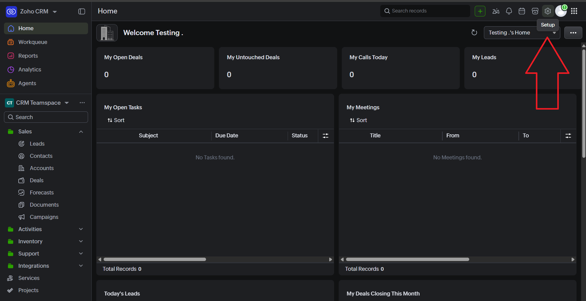

**Setup (gear icon) → Developer Space → Widgets**

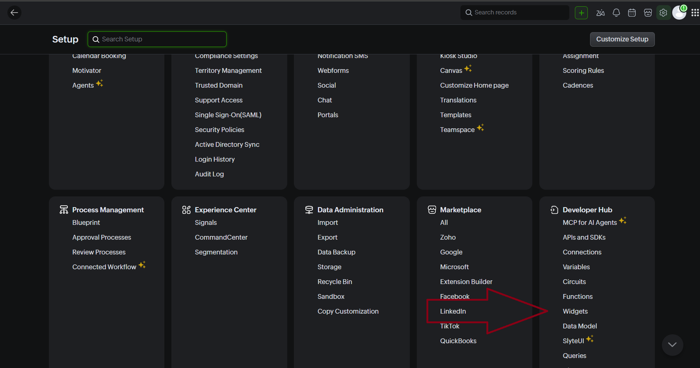


**Setup (gear icon) → Developer Space → Widgets → Create New Widget**

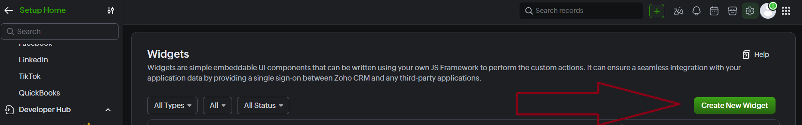


Then field the formulary

in this way

for example

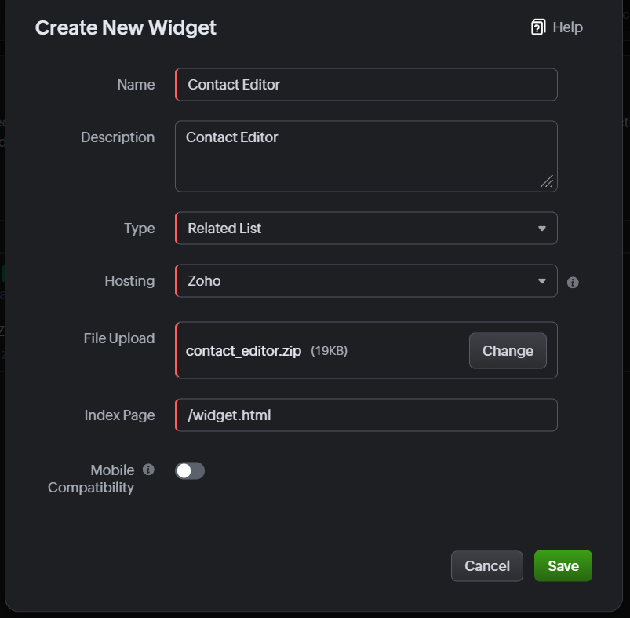


**Being mandatory**

| Field | Value |
|---|---|
| Type | **Related List** — the only widget type that lives embedded inside a single record's detail view and receives that record's ID via `PageLoad` |
| Hosting | **Zoho** |
| File Upload | `contact_editor.zip` from step 2 |
| Index Page | **`/widget.html`** exactly — *not* `/app/widget.html` |


**Why `/widget.html` and not `/app/widget.html`:** the zip keeps the `app/` folder nested inside it
(this is intentional — see [Assumptions](#assumptions)). Zoho unzips the package and folds that
top-level folder into the auto-generated Base URL itself, so the Index Page is resolved *relative
to that already-computed Base URL*, not to the zip's root. Pointing Index Page at `/app/widget.html`
duplicates the segment and 404s.
### 4. Add it to the Contact layout

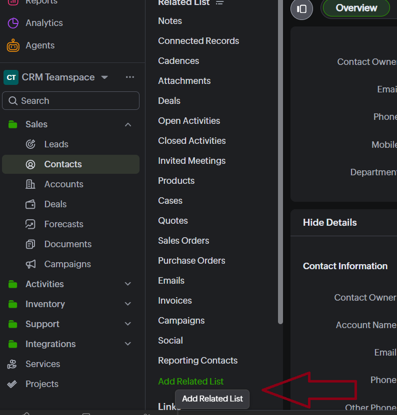

Open any Contact → left sidebar → **Add Related List** → select the widget you just created. It's
now visible on every Contact using that layout.

Choose widget


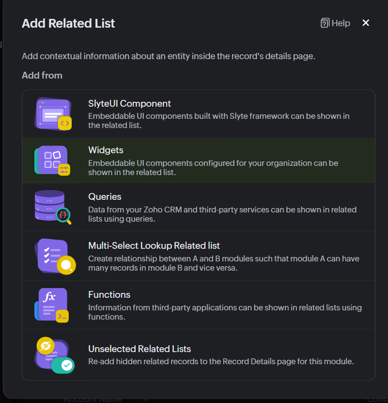


Install

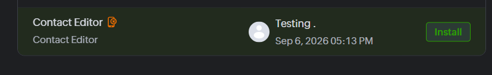


Put the name


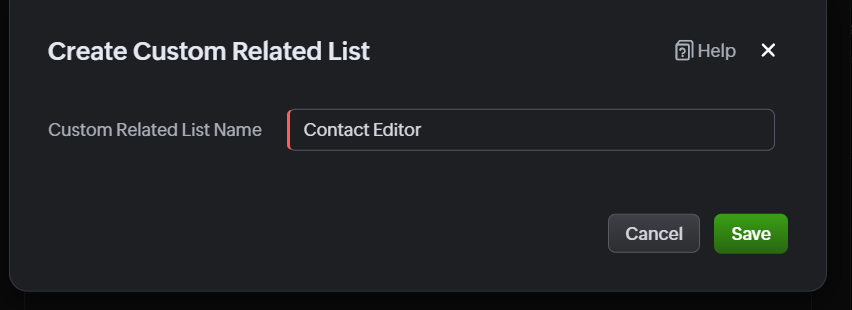


It can be organized (the order)

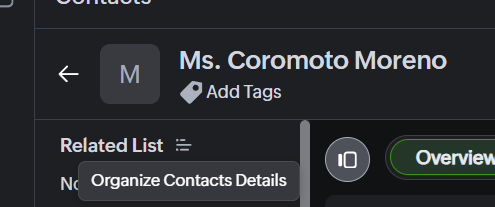

It can be moved

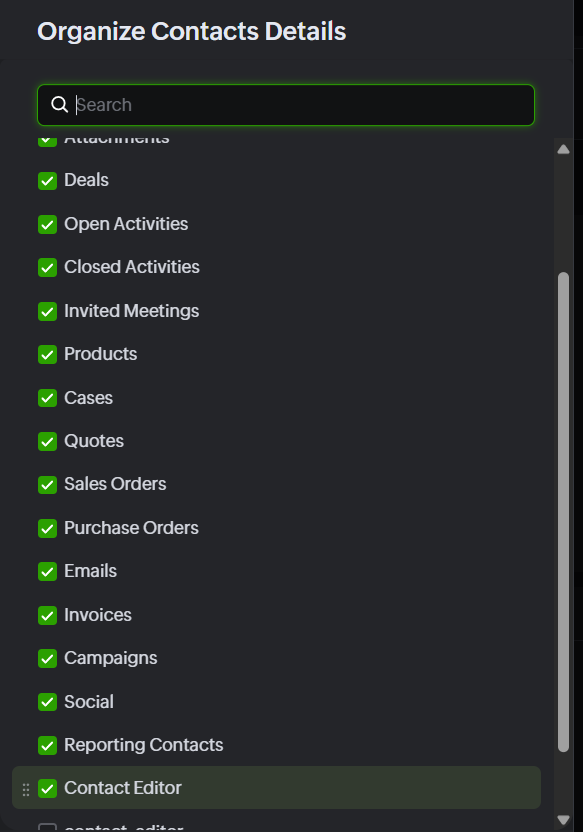


And then it's available 

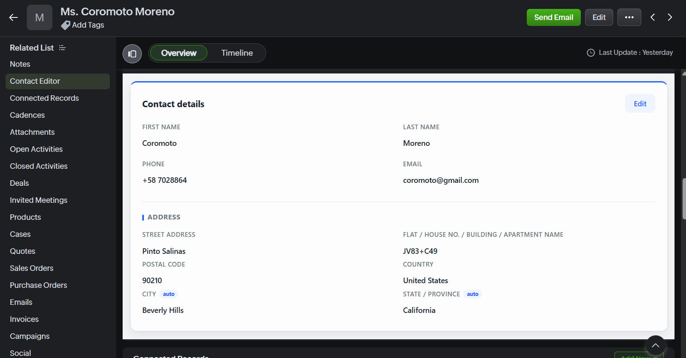


### 5. Verify

Open a test Contact. You should see the widget load that Contact's real data (not a placeholder),
be able to edit and save, and see the change survive a full page reload. No "insecure" warning
should appear anywhere — that's specific to the local-dev path described below.

## Local development (alternative)

While building this, the widget was hosted **externally**: `zet run` serves it live from
`https://localhost:5000/app/widget.html` with no rebuild step — edit a file, refresh the browser,
see the change. That's faster to iterate with, but it depends on a self-signed dev certificate (the
browser needs to be told to trust it once) and on a terminal staying open on the developer's
machine, which is why the final delivery uses Zoho hosting instead.

To try it: `npm install` inside `contact_editor/`, generate a local cert via a throwaway `zet init`
(the repo's `.gitignore` deliberately excludes `cert.pem`/`key.pem` — they're private keys, so every
fresh clone needs its own pair), run `zet run`, trust the certificate once, then register a widget
in Developer Space with **Hosting: External** and Base URL `https://localhost:5000/app/widget.html`.

**Worth noting:** External hosting isn't inferior to Zoho hosting as a *model* — Zoho just fetches
the widget from whatever URL you give it, regardless of who serves it. The only reason it doesn't
suit this delivery is that the URL pointed at a personal laptop with a self-signed cert. Run that
same server on a **VPS with a real domain and a Let's Encrypt certificate**, and External hosting
becomes a fully legitimate production option — with the added benefit of shipping updates with a
`git pull` and a process restart instead of rebuilding and re-uploading a zip through the Zoho UI
each time. If Qualicare already runs a VPS for other client work, that's worth weighing against
Zoho hosting rather than defaulting to Zoho hosting as the only "correct" answer.

## Address lookup API — choice and why

The widget queries three free sources **in a cascade**, falling through to the next one only if the
previous one returns nothing:

1. **[GeoNames](https://www.geonames.org/export/web-services.html)** (primary) — best general
   country coverage among the free options, community-maintained. Requires a free account with the
   "free webservice" flag enabled (no card).
2. **[Zippopotam.us](https://www.zippopotam.us/)** (first fallback) — by its own documentation, its
   dataset is adapted from GeoNames, so it isn't independent coverage; it's mainly a stable mirror
   for when the GeoNames account has a hiccup.
3. **[Nominatim](https://nominatim.org/) (OpenStreetMap)** (second fallback) — genuinely independent
   data. Verified live with a real gap case: Nigerian postal code `900211` returns empty from
   GeoNames and 404s on Zippopotam, but resolves correctly on Nominatim. It also has no Canada
   coverage at any precision, which is why it sits last, behind Zippopotam (which does cover Canada).

**Why not Google Maps Geocoding API:** better global coverage and precision than all three combined,
but as of 2026 it requires a Google Cloud account with **billing enabled and a card on file** even
to stay inside the free monthly quota. The brief asks for an API that's "free or free-tier" —
requiring a card from whoever spins this up in a fresh org is real friction the three sources above
don't have.

**Known limitations:**

- **Nominatim's usage policy** asks apps to identify themselves via `User-Agent` or `Referer`.
  Browsers block JS from setting a custom `User-Agent` in `fetch()`, so the widget relies on the
  `Referer` the browser sends automatically. It also requires ≤1 request/second, which is fine for
  this widget's single-lookup-at-a-time, debounced (600ms) usage pattern but wouldn't scale to
  bulk/high-traffic use as-is.
- **The GeoNames username is currently hardcoded** in `script.js` as a single shared free account.
  Every deployment of this widget draws against that one account's daily quota — fine for an
  evaluation, not fine for real multi-customer production use (see below).
- **Non-English results:** neither GeoNames' postal-code endpoint nor Zippopotam support a language
  parameter, so City/Province come back in whatever script the source has on file — confirmed live
  that Russian postal codes return Cyrillic (e.g. `Москва`) unless Nominatim (which does support
  `accept-language=en`) happens to be the source that resolves it.
- A postal code alone doesn't uniquely identify a country (e.g. `90210` matches 7 countries across
  GeoNames' unscoped search), so Country is only auto-filled when the lookup resolves to exactly one
  country; otherwise the user picks from a country combobox before the address lookup runs.

## What I'd do differently with more time

- **Move the GeoNames credential server-side** (or let each deployment supply its own), instead of
  one hardcoded username shared by every install of this widget.
- **Map the ~180-country selector against each org's actual `Mailing_Country`/`Mailing_State`
  picklist values.** Right now the widget writes free text into those two fields, which works only
  because this dev org's picklists aren't locked to a closed list — an org with closed picklists
  could reject the write or create an inconsistent value.
- **Normalize non-English City/Province values** by re-querying Nominatim with `accept-language=en`
  whenever a result comes back in a non-Latin script, instead of only doing this for Nominatim's own
  results.
- **Scope the lookup down once the target company's actual contact profile is known.** The 3-API
  cascade (GeoNames → Zippopotam → Nominatim) exists to cover essentially any country for free,
  without asking anyone to enter a card anywhere — reasonable for a general-purpose submission where
  I don't know who'll be using it. But that breadth is a deliberate trade-off, not a free lunch: every
  extra layer (blank-country auto-detect, wrong-country recovery, merging two sources for ambiguous
  cases) was added in response to a real edge case found while testing, and each one is more surface
  area to maintain and explain. With visibility into Qualicare's real contact base — if it's
  overwhelmingly US/Canada, say — I'd narrow the country list and lean on a single well-covered
  source instead of the full cascade, trading broad theoretical coverage for a smaller, easier-to-audit
  widget tuned to the accounts it'll actually see.
- **Consider a bounded/reordered country list** based on an unscoped postal-code query, instead of
  the full alphabetical ~180-country combobox — evaluated and set aside for this submission because
  the benefit was marginal (a US ZIP still matches 7-12 countries) relative to the added API call and
  state to manage. This would matter less if the scoping above already narrows the list.
- **Invest further in visual design**, likely by rebuilding the UI with a small component framework
  (React fits fine here — Zoho widgets are just an embedded web page, so nothing about the SDK
  requires vanilla JS; it was the plain-HTML route that was chosen for this submission specifically
  to avoid a build step under the time budget) paired with a proper component/design system instead
  of hand-rolled CSS. That would buy more polished interaction details — transitions, a consistent
  spacing/typography scale, richer states — for less custom code than maintaining that by hand.

## Assumptions

- The target org's `Mailing_Country` and `Mailing_State` fields accept new picklist values (not
  locked to a closed list) — true for the dev org this was built against; see the limitation above.
- Street Address stays manual per the brief. A **Flat/House No./Building/Apartment Name** field was
  added on top of that — it's a native field on the Zoho Contacts module (not a custom field), and
  the brief only specifies Street stays manual; it doesn't exclude adding another manual field to
  the same address block.
- Latitude/Longitude, which both lookup APIs return at no extra cost, are saved to the native
  `Mailing_Latitude`/`Mailing_Longitude` fields but not surfaced in the UI — raw coordinates don't
  help someone using this widget day-to-day to look up a contact.
- Only Name and Email are required to save; Phone and the address fields are optional, since those
  are the only two fields where an empty value actually breaks the point of a contact record
  (identifying them, or reaching them by email).
- The package's `app/` folder is intentionally kept nested inside the Zoho hosting zip (via
  `zet pack`) rather than flattened — flattening it changes the Base URL Zoho generates and breaks
  the Index Page path (see [step 3](#3-create-the-widget-in-your-org)).
- Per the brief's explicit scope, this widget does not implement authentication/permission handling,
  support for modules other than Contacts, automated tests, or multi-language support. The interface
  itself is English-only for the same reason, even though development discussion happened in Spanish.

## Tech stack

Plain HTML/CSS/JS (`contact_editor/app/`), no framework or bundler — deliberate, given this was a
first project with `zet` under a tight time budget: fewer moving parts that can break under time
pressure. Communicates with Zoho CRM via the `ZohoEmbededAppSDK` (`postMessage` under the hood):
`ZOHO.embeddedApp.init()` for the handshake, `PageLoad` for the current record ID, and
`ZOHO.CRM.API.getRecord`/`updateRecord` for reads and writes.
